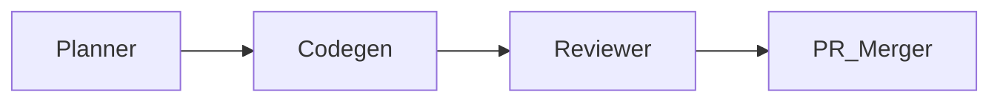

# Agents Specification

CodePro Mark1 orchestrates a set of agents to iterate on the codebase.

## Planner
- **Goal:** Break a user request into actionable tasks.
- **Input:** high-level goal and repository state.
- **Output:** `plan.md` detailing targets, tests, and risks.
- Ensures determinism via `OPENAI_RUN_SEED`.

## Codegen
- **Goal:** Implement the plan.
- **Input:** `plan.md` and relevant files.
- **Output:** `patch.diff` and `notes.md`.
- Must respect `AGENTS.md` instructions within scope.

## Reviewer
- Executes linters, type checks, and tests.
- Rejects changes if checks fail or style guidelines are violated.
- Provides feedback for remediation.

## PR Merger
- Gathers approved commits and opens a GitHub pull request.
- Requires all checks to pass before merging.
- Summarises work for human review.

Agents communicate solely via Git commits and pull request comments,
enabling a reproducible, auditable development flow.
